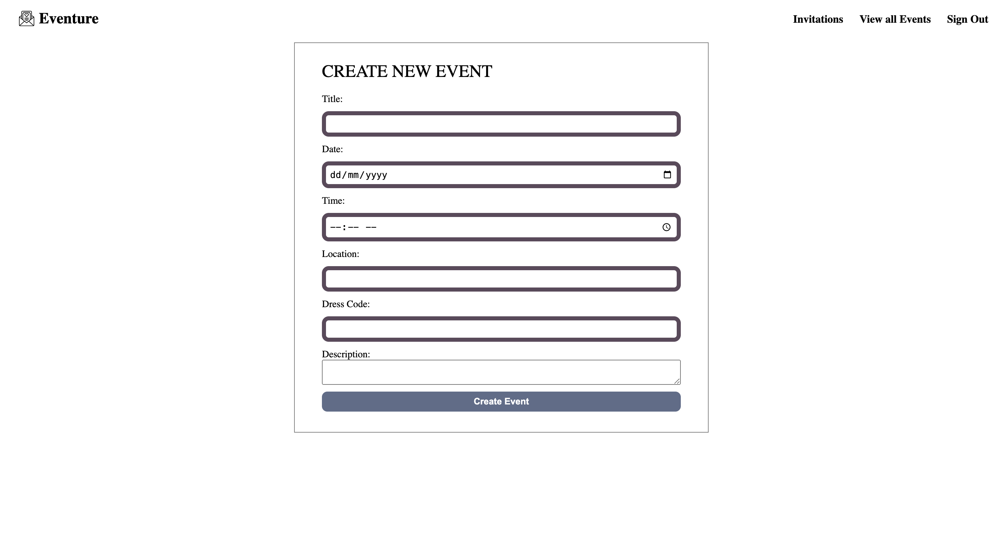

Deployment Link: [deploy](https://project-event-994369872881.herokuapp.com/).
# Event Planner




## Project Overview
diblo [GitHub Pages](https://pages.github.com/).

**Project Name:** Eventure 
**Description:**  
The Event Planner app is a platform that allows users to create, manage, and track events and their attendees. Each user can organize multiple events, and each event can host multiple attendees. With secure login and role-based permissions, users can view, update, and manage their own events while giving attendees the ability to RSVP and update their invitation status. This structure supports both personal event planning and larger event management needs.

---

## Key Features

- **User Authentication:** sign-up, login, and logout functionality.
- **Event Management:** Users can create, view, update, and delete events.
- **Attendee Management:** Add and manage attendees for events, with attendees able to update their RSVP status.
- **Permissions:** Only users who create events can manage their details, and only attendees can edit their invitation status.

--- 

## Data Model

### Models

#### User Model

| **Field**  | **Type** | **Required** | **Unique** | **Description**                                       |
|------------|----------|--------------|------------|-------------------------------------------------------|
| `username` | String   | Yes          | Yes        | Unique username for user identification.              |
| `password` | String   | Yes          | No         | Encrypted password for secure authentication.         |
| `email`    | String   | Yes          | Yes        | Unique email address for user login, validated for format.|

#### Event Model

| **Field**     | **Type**                        | **Required** | **Description**                                                                 |
|---------------|---------------------------------|--------------|---------------------------------------------------------------------------------|
| `title`       | String                          | Yes          | Title of the event.                                                             |
| `date`        | String                          | Yes          | Date of the event.                                                              |
| `time`        | String                          | Yes          | Time when the event will take place.                                            |
| `location`    | String                          | Yes          | Location of the event.                                                          |
| `dressCode`   | String                          | Yes          | Dress code for the event.                                                       |
| `description` | String                          | Yes          | Brief description of the event.                                                 |
| `owner`       | ObjectId (ref: `User`)          | Yes          | Reference to the user who created the event.                                    |
| `attendees`   | Array of attendee objects       | No           | List of attendees, each with a user reference and RSVP status.                  |

Each `attendee` object within the `attendees` array has the following structure:

| **Field** | **Type**                        | **Required** | **Description**                                                                       |
|-----------|---------------------------------|--------------|---------------------------------------------------------------------------------------|
| `user`    | ObjectId (ref: `User`)          | Yes          | Reference to the attendee user.                                                      |
| `status`  | String                          | No           | RSVP status with options: `'Invited'`, `'Accepted'`, `'Declined'`. Default is `'Invited'`. Only the attendee can edit their own status. |


### Database Schema 

```javascript


const userSchema = new mongoose.Schema({
  username: { type: String, required: true, unique: true },
  password: { type: String, required: true },
  email: { type: String, required: true, unique: true, match: [/^\S+@\S+\.\S+$/, 'Please enter a valid email address.'] },
});


const User = mongoose.model('User', userSchema);
```

```javascript


const eventSchema = new mongoose.Schema({
  title: { type: String, required: true },
  date: { type: String, required: true },
  time: { type: String, required: true },
  location: { type: String, required: true },
  dressCode: { type: String, required: true },
  description: { type: String, required: true },
  owner: { type: mongoose.Schema.Types.ObjectId, ref: 'User', required: true },
  attendees: [
    {
      user: { type: mongoose.Schema.Types.ObjectId, ref: 'User' },
      status: { type: String, enum: ['Invited', 'Accepted', 'Declined'], default: 'Invited' },
    },
  ],
});


const Event = mongoose.model('Event', eventSchema);
```
---

## Route Documentation

### Events Routes

The `events` routes manage the creation, editing, deletion, and display of events, as well as attendee invitations.

| **HTTP Method** | **Route**                    | **Description**                                                                                                     |
|-----------------|------------------------------|---------------------------------------------------------------------------------------------------------------------|
| GET             | `/`                          | Retrieves and displays all events with populated owner data.                                                        |
| GET             | `/new`                       | Renders a form for creating a new event.                                                                            |
| POST            | `/`                          | Creates a new event and associates it with the logged-in user as the owner.                                         |
| GET             | `/:eventId`                  | Retrieves and displays details of a specific event, including attendees and owner information.                      |
| GET             | `/:eventId/edit`             | Renders an edit form for a specific event.                                                                          |
| PUT             | `/:eventId`                  | Updates a specific event if the logged-in user is the owner.                                                        |
| DELETE          | `/:eventId`                  | Deletes a specific event if the logged-in user is the owner.                                                        |
| POST            | `/:eventId/attendees`        | Adds a user as an attendee to a specific event and sends them an invitation email if they are not  attendee |
| POST            | `/:eventId/status`           | Updates the attendance status (accept/decline) for a specific event for the logged-in user.                         |

### Invitations Routes

The `invitations` routes handle the display of events to which the logged-in user is invited.

| **HTTP Method** | **Route** | **Description**                                                                                           |
|-----------------|-----------|-----------------------------------------------------------------------------------------------------------|
| GET             | `/`       | Retrieves and displays all events where the logged-in user is an attendee, including owner and attendee details. |

---

## User Stories

### User Registration and Authentication
1. As a user, I want to create an account for a personalized experience.
2. As a user, I want to log in with my credentials to access my events and attendees.

### Event Management
1. As a user, I want to create a new event with details like title, date, time, location, dress code, and description.
2. As a user, I want to view all my events for easier management.
3. As a user, I want to update an event to adjust details as needed.
4. As a user, I want to delete an event if it's no longer needed.

### Attendee Management
1. As a user, I want to add attendees to my event to keep track of who is attending.
2. As a user, I want to view the list of attendees for a specific event to monitor RSVPs.
3. As a user, I want attendees to update their invitation status (accepted/declined).
4. As an attendee, I want to update my RSVP status to confirm or decline attendance at an event.

### Notes

- Only event creators (owners) can manage event details and attendees.
- Attendees have permission to edit their invitation status but cannot modify event details.

---
## Technologies Used

- **HTML**
- **CSS**
- **JavaScript (Node.js & Express)**
- **MongoDB**
- **Nodemailer**
- **EJS (Embedded JavaScript)**

```javascript


 // configure mail options with event details 
      let mailOptions = {
        from: '"Events" <eventplannergabh@gmail.com>',
        to: user.email,
        subject: `Invitation to ${event.title}`,
        html: `
        <h1>🎉 You're Invited! 🎉</h1>
       <p><strong>📅 Event:</strong> ${event.title}</p>
      <p><strong>🗓️ Date:</strong> ${event.date}</p>
      <p><strong>⏰ Time:</strong> ${event.time}</p>
     <p><strong>📍 Location:</strong> ${event.location}</p>
      <p><strong>👗 Dress Code:</strong> ${event.dressCode}</p>
      <p><strong>📝 Description:</strong> ${event.description}</p>
       <p>🚀 Please visit the event page to accept the invitation!</p>

        `,
      };
  
      // Send the email
      transporter.sendMail(mailOptions, (error, info) => {
        if (error) {
          console.log('Error:', error);
        } else {
          console.log('Email sent:', info.response);
        }
      });
```
